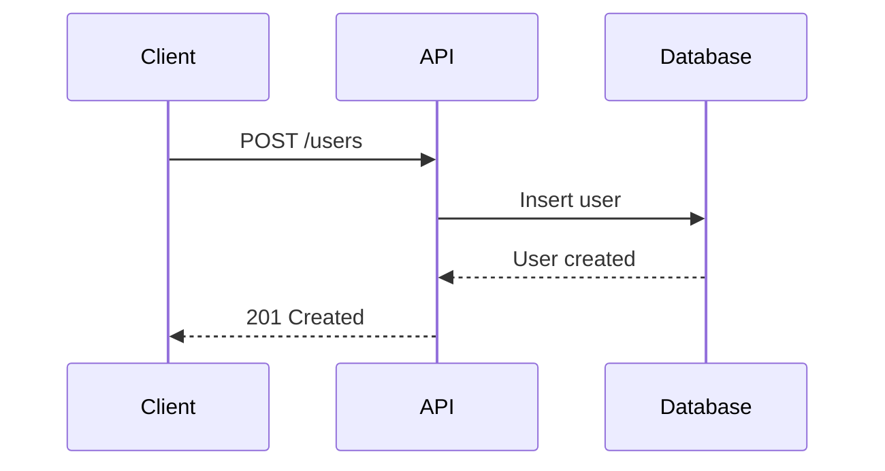

# User Guides & Tutorials

## Tutorial Structure

### Progressive Learning Path

Use a quick-start with prerequisites checklist, minimal working code, expected output, and next-steps links.

````markdown
# Getting Started with API

## Prerequisites

- [ ] Node.js 18+ installed
- [ ] An API key from your dashboard

## Quick Start (5 minutes)

### 1. Install the SDK

```bash
npm install @myapi/sdk
```

### 2. Create Your First Request

```typescript
import { Client } from "@myapi/sdk";

const client = new Client({ apiKey: "your_key" });
const users = await client.users.list();
console.log(users);
```

### 3. Verify It Works

Expected output:

```json
{ "data": [{ "id": "1", "name": "Alice" }], "total": 1 }
```

## Next Steps

- [Authentication Guide](/docs/auth)
- [Error Handling](/docs/errors)
````

### Step-by-Step Tutorial

Each step: goal, code, brief "what's happening" note. Use a checkpoint list mid-way. End with a "next step" link. Show 2–3 representative steps; remaining steps follow the same pattern.

````markdown
# Tutorial: Building a User Dashboard

**What you'll learn:** Fetch users, handle pagination, display in a table

**Time:** 30 minutes | **Level:** Intermediate

## Step 1: Set Up the Project

```bash
mkdir user-dashboard && cd user-dashboard
npm init -y && npm install @myapi/sdk react
```

## Step 2: Fetch Users

```typescript
// src/api/users.ts
import { Client } from "@myapi/sdk";

const client = new Client({ apiKey: process.env.API_KEY });

export async function getUsers(page = 1, limit = 20) {
  return client.users.list({ page, limit });
}
```

## Step 3: Create the Component

```typescript
// src/components/UserTable.tsx
import { useState, useEffect } from "react";
import { getUsers } from "../api/users";

export function UserTable() {
  const [users, setUsers] = useState([]);
  const [loading, setLoading] = useState(true);

  useEffect(() => {
    getUsers().then((data) => {
      setUsers(data.data);
      setLoading(false);
    });
  }, []);

  if (loading) return <div>Loading...</div>;

  return (
    <table>
      <thead>
        <tr>
          <th>Name</th>
          <th>Email</th>
        </tr>
      </thead>
      <tbody>
        {users.map((user) => (
          <tr key={user.id}>
            <td>{user.name}</td>
            <td>{user.email}</td>
          </tr>
        ))}
      </tbody>
    </table>
  );
}
```

## Checkpoint

- [x] SDK set up
- [x] API helper created
- [x] Table component built
- [ ] Pagination (Step 4)

[Continue to Step 4 →](/docs/tutorial/step-4)
````

## Information Architecture

### Content Hierarchy

Organise docs into a predictable tree so users can orient themselves quickly.

```text
Documentation/
├── Getting Started/ (Quick Start, Installation, Authentication)
├── Guides/ (User Management, File Uploads, Webhooks)
├── API Reference/ (per-resource pages)
├── Tutorials/ (end-to-end, time-labelled)
└── Resources/ (Troubleshooting, FAQ, Migration Guides)
```

## Writing Techniques

### Task-Based Writing

Frame every guide around a goal. Include time estimate, ordered steps with inline code, a "Common Issues" section, and related links.

````markdown
# How to Upload a File

**Goal:** Upload an image to account storage | **Time:** 5 minutes

### 1. Get the file

```typescript
const file = document.querySelector('input[type="file"]').files[0];
```

### 2. Upload with the SDK

```typescript
const formData = new FormData();
formData.append("file", file);
const result = await client.files.upload(formData);
console.log("File URL:", result.url);
```

## Common Issues

- **"File too large"** — Max 10 MB; compress before uploading.
- **"Invalid file type"** — Only `.jpg`, `.png`, `.gif` are accepted.

## Related

- [File API Reference](/api/files)
````

### Progressive Disclosure

Show the simplest option first; hide advanced alternatives in `<details>` blocks so beginners aren't overwhelmed.

````markdown
## Basic: API Keys (Recommended for Getting Started)

```typescript
const client = new Client({ apiKey: "your_key" });
```
````

**When to use:** Scripts, internal tools, testing

<details>
<summary>Advanced: OAuth 2.0</summary>

For user-facing apps, use the Authorization Code flow:

```typescript
// Step 1 — redirect
const authUrl = client.oauth.getAuthUrl({ redirectUri: "...", scopes: [...] });
// Step 2 — exchange code
const tokens = await client.oauth.exchangeCode(code);
// Step 3 — use token
const client = new Client({ accessToken: tokens.access_token });
```

[Full OAuth guide →](/guides/oauth)

</details>

<details>
<summary>Enterprise: JWT Tokens</summary>

```typescript
const jwt = createJWT({
  issuer: "your-service",
  privateKey: process.env.PRIVATE_KEY,
});
const client = new Client({ jwt });
```

</details>

## Visual Communication

### Diagram Integration

Use Mermaid for flow and data-model diagrams; keep them close to the prose they illustrate.

````markdown

````

### Screenshot Annotations

Pair annotated screenshots with a numbered key; follow with step-by-step instructions that reference the annotation numbers.

```markdown


1. **Navigation** — switch sections
2. **API Key** — click to reveal and copy
3. **Usage Stats** — current month's calls

## Creating Your First API Key

1. Click "Generate New Key" (item 2 above)
2. Enter a description and select permissions
3. **Copy immediately** — it won't be shown again
```

## Troubleshooting Guides

### Problem-Solution Format

Each entry: symptom → causes → numbered solutions → escalation path.

````markdown
# Troubleshooting

## "Invalid API key" (401)

**Causes:** extra spaces when copying, key revoked, test key in production.

**Fix 1 — verify length:**

```bash
echo -n "$API_KEY" | wc -c  # must be 32
```

**Fix 2 — regenerate:** Dashboard → "Revoke & Regenerate" → update env vars.

**Still failing?** [Contact support](/support) with the request ID from the error.

---

## "Rate limit exceeded" (429)

**Immediate fix:** wait 60 s and retry.

**Long-term — exponential backoff:**

```typescript
async function retryWithBackoff(fn, maxRetries = 3) {
  for (let i = 0; i < maxRetries; i++) {
    try {
      return await fn();
    } catch (error) {
      if (error.status === 429 && i < maxRetries - 1) {
        await new Promise((r) => setTimeout(r, 2 ** i * 1000));
        continue;
      }
      throw error;
    }
  }
}
```

**Other options:** batch requests, or [upgrade your plan](/pricing).
````

## FAQ Section

Group by audience (General, Technical, Billing). Keep answers to 1–3 lines; link to full guides for complex topics. End with an escalation block.

```markdown
# Frequently Asked Questions

## General

**What's in the free tier?** 1 000 requests/month, 1 GB storage, all core features.

**How do I upgrade?** Click "Upgrade" in your [dashboard](/dashboard).

## Technical

**Production-ready?** Yes — 99.9% SLA on paid plans.

**Rate limits?** Free: 10 req/min · Pro: 100 req/min · Enterprise: custom.

**Webhooks supported?** Yes. See [Webhooks Guide](/guides/webhooks).

## Billing

**How does billing work?** Monthly subscription + pay-as-you-go overages; cancel anytime.

---

**Can't find your answer?** [Browse docs](/docs) · [Community](https://community.example.com) · [Support](/support)
```

## Quick Reference

| Content Type | Best For           | Key Elements                        |
| ------------ | ------------------ | ----------------------------------- |
| Quick Start  | New users (5 min)  | Prerequisites, minimal code, verify |
| Tutorial     | Learning by doing  | Steps, checkpoints, working code    |
| How-To Guide | Specific tasks     | Goal, steps, troubleshooting        |
| Reference    | Looking up details | Comprehensive, searchable           |
| Explanation  | Understanding why  | Why, not how                        |

| Writing Principle | Technique                                |
| ----------------- | ---------------------------------------- |
| Clarity           | Active voice, short sentences            |
| Scannability      | Headings, lists, code blocks             |
| Completeness      | Prerequisites, next steps, related links |
| Accuracy          | Test all code, version specifics         |
